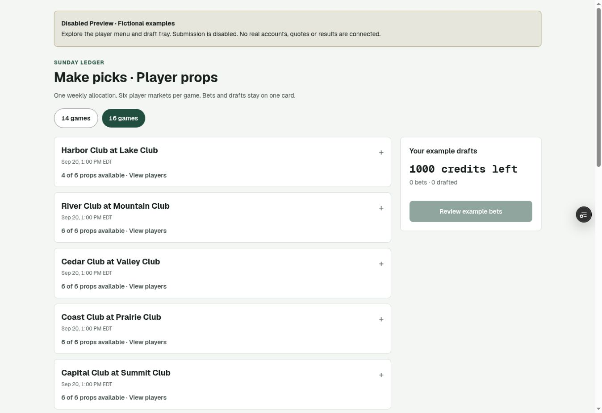
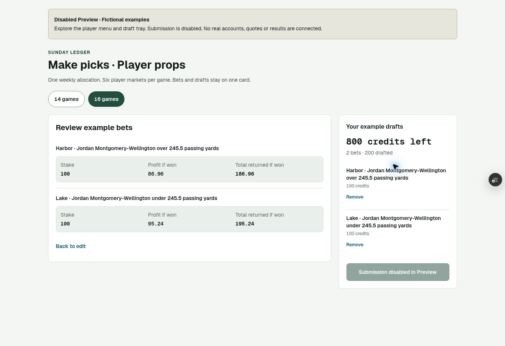

# Disabled player-props Preview verification

Verified September 14, 2026. This is fictional UI evidence; no real accounts,
provider quotes, results, accepted bets, or Production rollout were exercised.

| Fact                    | Evidence                                                                                                                                      |
| ----------------------- | --------------------------------------------------------------------------------------------------------------------------------------------- |
| PR                      | [#51](https://github.com/alexpfeffer4/sunday-ledger-matchups/pull/51)                                                                         |
| Browser-verified commit | `b6900188cfdddcd36ae784875a6883a409d7d557`                                                                                                    |
| Deployment              | `dpl_936nV6Gs6rvURxMhdwttJPu53bt4`                                                                                                            |
| Target / state          | Preview / `READY`                                                                                                                             |
| Exact verified URL      | [Disabled player-props Preview](https://sunday-ledger-matchups-4hnu1jbkr-pfeffer.vercel.app/preview/player-props)                             |
| Build                   | Next.js; Node.js 24; build log reports 17 seconds; build-to-ready approximately 28 seconds                                                    |
| Browser viewport        | Chrome, 1348 × 936 CSS pixels with a scrollbar; no horizontal overflow                                                                        |
| Access                  | Vercel deployment protection retained. Browser used the connected account's temporary Preview share access. No bypass token is recorded here. |

## Hosted interaction checks

- The page clearly labels itself **Disabled Preview · Fictional examples** and
  declares that submission is disabled.
- Sixteen games begin collapsed. Expanding the first game reveals the six
  player slots, with four available quotes, one known player awaiting a line,
  and one unresolved player slot unavailable for the week.
- Both quarterbacks in one game can be drafted independently. Each received
  100 credits; the shared tray retained both drafts and showed 800 credits left.
- Review displays both players and their own expected returns. The final
  **Submission disabled in Preview** button was disabled.
- Switching to the 14-game sample preserved both drafts.
- No app-origin warnings or errors appeared in the captured browser console.
  Earlier Vercel sign-in/FedCM and browser-extension messages were excluded.
- Screenshots were inspected for readable long player names, clear selection
  and review states, spacing, and horizontal overflow.

## Backend and hosting boundaries

The Preview route imports the fictional client component without account,
provider, or submission actions. It returns `notFound()` in Production.
The Next.js build publishes the deployment identity from `VERCEL_ENV`.
`getSupabasePublicConfig()` blocks Preview access unless the explicitly declared
`PREVIEW_SUPABASE_REF` is a different project from Production and exactly matches
the configured HTTPS Supabase host. Browser, server, proxy, and provider client
factories use this configuration gate. The three isolation unit tests passed.

The connected Vercel team reports **Hobby**. The deployed slate, card, and
commissioner routes export `maxDuration = 120`; this build was accepted and reached
`READY`. Vercel's current [duration documentation](https://vercel.com/docs/functions/configuring-functions/duration)
allows up to 300 seconds on Hobby with Fluid Compute, so 120 seconds fits that
documented limit. The connector does not expose the project's effective Fluid
setting or individual function configurations; those exact deployed settings
still belong in the release preflight. No plan change is required merely by
the documented 120-second duration.

## Limits of this evidence

This hosted check does not establish isolated Supabase Auth, acceptance RPC,
provider entitlement, settlement, or protected correction behavior. Those need
their separate native/CI and isolated backend acceptance evidence. A rendered
sign-in page does not establish a configured isolated Auth service. The remote
browser exposes no viewport resize operation, so this report claims desktop
visual verification only; mobile checks belong to the native browser suite.

The Odds API dashboard was also checked read-only for an existing authenticated
session. It showed its sign-in form, so the actual current subscription tier
could not be verified. No credentials were entered, keys exported, account
screenshots taken, subscription changed, or provider API request made.
